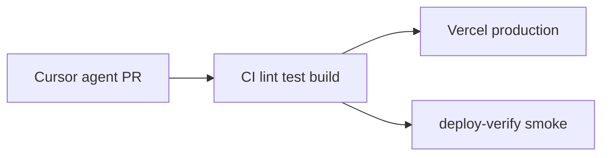

# Miniature Studio

*(Previously **obsessions**)*

A visual timeline and collage archive for hobbyists tracking dioramas, 1:6 scale miniatures, custom dolls, and related inspiration. Users save images, notes, and links into imperfect auto-layout collages and scroll through aesthetic “eras” over time.

**Production:** [obsessions-snowy.vercel.app](https://obsessions-snowy.vercel.app)  
**Access:** Invite-only waitlist (no public sign-up). See [AGENTS.md](AGENTS.md) for policy invariants.

---

## Stack

| Layer | Technology |
|-------|------------|
| App | [Next.js 15](https://nextjs.org/) (App Router), React 19, TypeScript |
| Data & auth | [Supabase](https://supabase.com/) (Postgres, Auth, Storage, RLS) |
| UI | Tailwind CSS, Framer Motion, Zustand |
| Deploy | [Vercel](https://vercel.com/) |
| Security (prod) | Cloudflare Turnstile, Upstash rate limits — [docs/security.md](docs/security.md) |
| Observability | Sentry — [docs/observability.md](docs/observability.md) |

---

## Development

### Prerequisites

- Node.js 20+
- A Supabase project with migrations applied (see `supabase/migrations/`)

### Setup

```bash
cp .env.example .env.local
# Required: NEXT_PUBLIC_SUPABASE_URL, NEXT_PUBLIC_SUPABASE_ANON_KEY
# Optional locally: NEXT_PUBLIC_SITE_URL, SUPABASE_SERVICE_ROLE_KEY (account deletion)
npm install
npm run dev
```

Open [http://localhost:3000](http://localhost:3000). Without env vars you are redirected to `/setup`.

### Scripts

| Command | Purpose |
|---------|---------|
| `npm run dev` | Local dev server |
| `npm run build` | Production build |
| `npm run lint` | ESLint |
| `npm run test:run` | Vitest (unit/component) |
| `npm run test:k6:waitlist-smoke` | k6 smoke (needs `BASE_URL`) — [docs/k6.md](docs/k6.md) |

**PR quality gate:** `npm run lint && npm run test:run && npm run build`

---

## AI & agent discovery

The app exposes machine-readable manifests for external assistants and automated agents:

| URL | Purpose |
|-----|---------|
| `/llm.txt` | Plain-text capabilities, waitlist policy, JSON schemas |
| `/.well-known/ai-plugin.json` | AI plugin manifest |
| `/skills` | Human-readable mirror of the above |

Canonical URLs use `NEXT_PUBLIC_SITE_URL` in production. Source of truth for copy: [`src/lib/site.ts`](src/lib/site.ts), kept in sync with `public/llm.txt` per [AGENTS.md](AGENTS.md).

---

## Agentic engineering

This repository is built for **Cursor agents + GitHub Actions**: implement on `cursor/*` branches, CI gates changes, Vercel deploys `main`.



| Mechanism | Behavior |
|-----------|----------|
| **CI** | Lint, test, build, secret scan on every PR and `main` |
| **Auto-merge** | PRs labeled `agent-pr` or branch `cursor/*` squash-merge when CI passes ([workflow](.github/workflows/auto-merge.yml)) |
| **Deploy verify** | After `main` deploy: smoke `llm.txt`, `/login`, `/skills`, waitlist API |
| **Agent contract** | [AGENTS.md](AGENTS.md) — invariants, forbidden paths, public routes |
| **k6** | Manual workflow for waitlist rate-limit checks — [docs/k6.md](docs/k6.md) |

Forbidden auto-merge paths (migrations, middleware, auth routes, fonts) require human review — see AGENTS.md.

---

## Documentation

| Doc | Audience |
|-----|----------|
| [AGENTS.md](AGENTS.md) | Agents & contributors — invariants, branches, forbidden paths |
| [docs/security.md](docs/security.md) | Turnstile, Upstash, headers, account export/delete |
| [docs/observability.md](docs/observability.md) | Monitoring tiers |
| [docs/runbooks/incident.md](docs/runbooks/incident.md) | Rollback & incidents |
| [docs/k6.md](docs/k6.md) | Load/smoke testing |
| [docs/github-setup.md](docs/github-setup.md) | Branch protection & auto-merge setup |

---

## Project structure

```
src/
  app/           # App Router pages & API routes (/api/entries, /api/waitlist, /api/account/*)
  components/    # Timeline, collage, capture modals, account settings
  lib/           # Collage layout, Supabase clients, security, site constants
  store/         # Timeline zoom/pan (Zustand)
public/
  llm.txt        # External AI instructions
  .well-known/   # ai-plugin.json
supabase/        # SQL migrations (applied manually in Supabase dashboard)
.github/         # CI, auto-merge, deploy-verify, Dependabot
.cursor/         # Cursor rules & deploy skill
docs/            # Runbooks & operational guides
```

---

## License

Private repository. All rights reserved unless otherwise noted.
